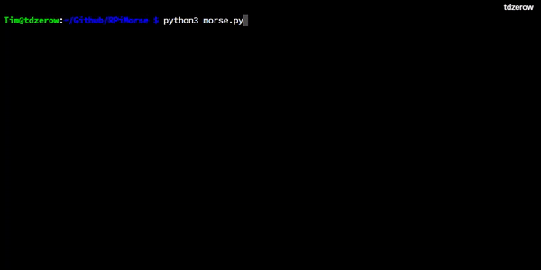
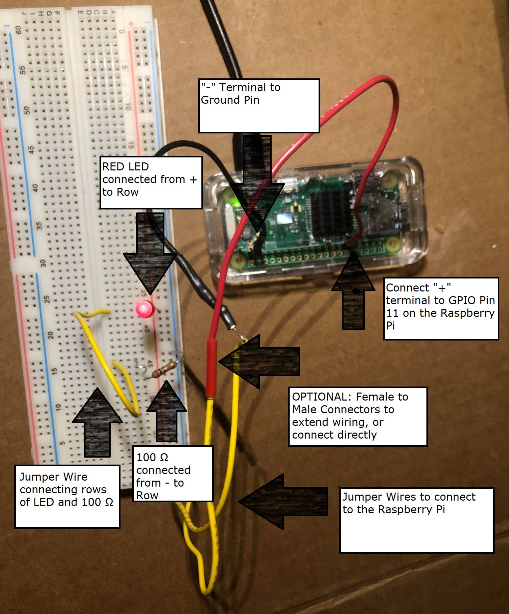
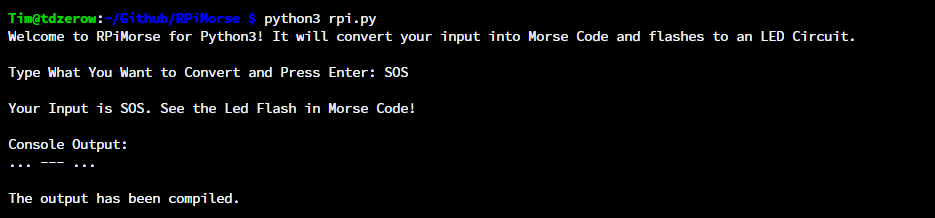
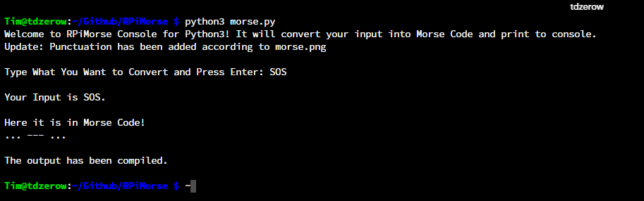

# [RPiMorse](https://github.com/dotimothy/RPiMorse)
A python program to convert standard input to morse code, printing to console (all) or flashing an LED via GPIO Pins ~~(Pin 11)~~. Run <code>morse.py</code> to get a universal Morse Code translator on console for any device with Python,or run <code>rpi.py</code> if you have a Raspberry Pi with an LED circuit for more real world translations!

## Update: RPiMorse now takes user input for any GPIO pin to use!

[Video Demonstration](https://www.youtube.com/watch?v=L291knyuKt0&ab_channel=TimothyDo)

 
 ## Global Requirments:
 Python Version 2 or higher
  
 ### For Pi Version:
 Raspberry Pi with GPIO Pins 
  
 An LED
  
 A 100 Ω Resistor
  
 A Breadboard
  
 3+ Jumper Wires (More for Stablity)
 
 ## Setup
 RPiMorse uses the following <a href="https://dotimothy.github.io/translations">translations</a> to convert regular input to Morse Code.
  
 For the LED Version, construct the following circuit: 
 
 
 After constructed, run <code>rpi.py</code> and input <code>11</code> for GPIO pin to get it running!
 
  # Documentation for Pi Version:
 
 For testing purposes, if your python version is 3 or higher, please run the program <code>rpi3.py</code>. If your version is lower, run <code>rpi2.py</code>.
 
  ## Or just run <code>rpi.py</code> for guranteed console functionality (chooses version for you, even with no Pi!).
  
  
 
 # Documentation for Console Versions: 
 For testing purposes, if your python version is 3 or higher, please run the program <code>morse3.py</code>. If your version is lower, run <code>morse2.py</code>.
 
 ## Or just run <code>morse.py</code> for guranteed console functionality (chooses version for you!).

